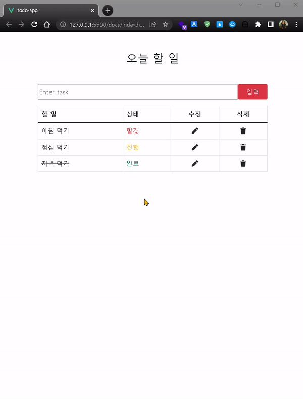

1. 작성일: 2022년 5월 24일(화)

2. 프로젝트명: Vue.js 만드는 ToDoList

3. 출처: https://www.youtube.com/watch?v=0fhetXYrNSw

4. Front: Vue.js

5. Back: 사용 안 함

6. 배포: Github Pages

7. 

8. 주소: https://hyundai-sangho.github.io/TodoList_vue.js/
